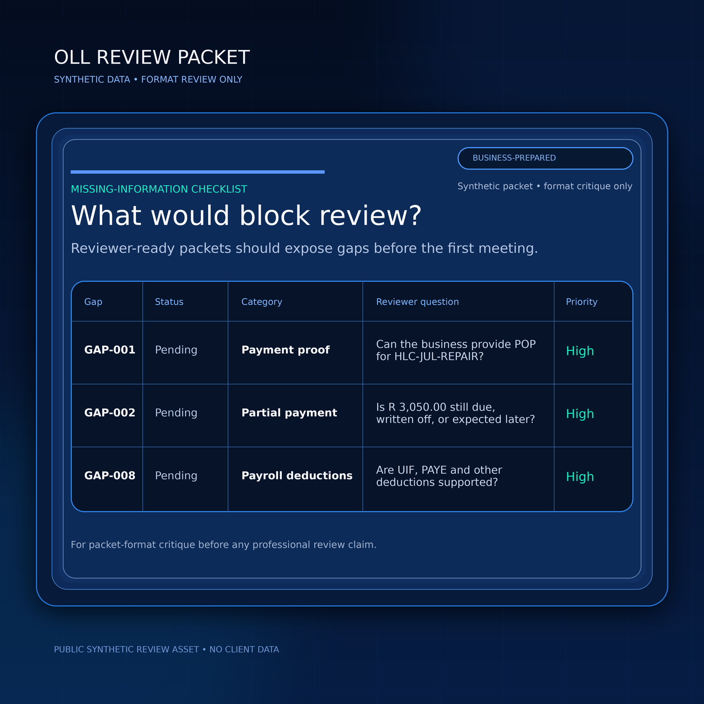

# OLL Synthetic Reviewer Packet

This repository contains a synthetic reviewer-ready packet for testing whether structured small-business records can reduce back-and-forth before review begins.

OLL is a review-support concept connected to OWK Ledger-Link. The purpose of this packet is not to provide accounting, tax, legal, payroll, audit, or compliance advice. The purpose is to test whether the packet format helps a reviewer understand business-provided records faster.

## What Is Included

- `packet/` - the main synthetic reviewer-ready packet
- `csv/` - register-style exports for structured review
- `source_docs/` - synthetic source document summaries
- `release/` - downloadable ZIP containing the packet materials
- `docs/REVIEWER_GUIDE.md` - review instructions and boundaries
- `docs/GITHUB_REVIEW_ISSUE_COPY.md` - suggested issue text for inviting review

## Review Boundary

Prepared by the business. Not professionally reviewed unless marked by a verified reviewer.

This packet uses synthetic data. No real business, client, employee, payment, bank, tax, ID, registration, invoice, or payroll data is included.

## What We Want Feedback On

Please review the packet format, not the business decisions.

1. What is missing before useful review could begin?
2. Which fields are unclear?
3. Which sections are unnecessary?
4. Which sections increase confidence?
5. Would this reduce back-and-forth with a business owner?
6. Would you prefer this as a static packet, CSV files, a link, or all three?

## Current Packet

- Packet ID: `OLL-SYN-001`
- Version: `v0.4 synthetic public test`
- Period: `01 July 2026 - 31 July 2026`
- Business: `Blue Basin Repairs (Synthetic)`
- Country context: South Africa
- Currency: South African rand, ZAR

## Not Included

This repository does not include application source code, private business data, non-public operating notes, credentials, production records, or customer records.

## v0.3 Correction

The v0.3 packet correction made bank-statement traceability and payslip deduction review fields more visible.

## v0.4 Correction

This correction adds `source_docs/BANKOLL001.md` so the bank-statement trace is represented as both structured CSV data and a source-document summary. GAP-006 is now marked resolved in v0.4; proof of payment remains unresolved under GAP-001.

## Rights Notice

Copyright © 2026 OWK Group (Pty) Ltd.

This repository is published for public review and feedback only. The synthetic packet may be viewed and commented on, but may not be reused, republished, modified, or redistributed without written permission from OWK Group (Pty) Ltd.
